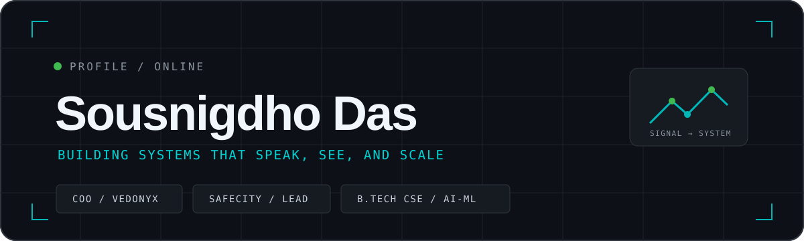
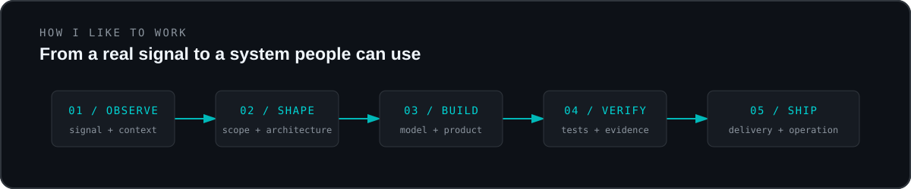

## About

I like working in the messy middle between an idea and something people can actually use: deciding what to build, shaping the architecture, writing the code, and keeping the team moving.

Working as **Chief Operating Officer at Vedonyx** & lead of **SafeCity** with StackOverHack, and pursuing **B.Tech CSE (AI/ML) at Newton School of Technology**. Most of my current work sits where multimodal systems, full-stack products, and product operations meet.

## Find me online

## Current coordinates

| Area | What I am doing |
| --- | --- |
| Building | Leading SafeCity as a production-grade, on-device multimodal personal-safety system |
| Operating | Working across product direction, delivery, and team coordination at Vedonyx |
| Learning | Pursuing B.Tech CSE (AI/ML) at Newton School of Technology |
| Exploring | Multimodal inference, full-stack systems, privacy-aware products, and civic technology |

## Selected work

| Project | What it does | My part |
| --- | --- | --- |
| [SafeCity](https://github.com/LiteralKrishu/SafeCity) | Combines audio, motion, contextual signals, and temporal fusion into a production-grade tiered safety workflow that runs on-device. | Team lead; architecture, orchestration, and development |
| [TransparAI](https://github.com/LiteralKrishu/TransparAI) | Helps people examine public-procurement data for unusual patterns, concentration, and delays. | StackOverHack team member; dashboard and hackathon work |
| [Glow Glitter](https://www.glowglitter.in/) | Turns a luxury soap brand into a polished ecommerce experience. | Shared design direction with Harshit Gupta; the wider Vedonyx team built it |

## Working stack

| Area | Tools |
| --- | --- |
| Product and mobile | Next.js, React, Node.js, Expo, React Native |
| AI and data | TensorFlow Lite, scikit-learn, Streamlit, Pandas, NumPy |
| Languages | TypeScript, JavaScript, Python, SQL |
| Delivery and design | Git, GitHub, Vercel, Figma |

## Highlights

- **Team Lead, SafeCity:** named as StackOverHack's team leader in the [2nd SmallAI Hackathon programme](https://smallai2026.thescrs.org/2nd-smallai-hackathon-program-schedule/).
- **Third Prize, TIH–IIT Mandi:** SafeCity's corresponding team finished third in the [Multimodal AI Hackathon](https://www.linkedin.com/posts/ihubiitmandi_multimodalai-hackathon-iitmandi-activity-7406989681428656128-irXj).
- **Third Place, SFLC.in Hackathon 2025:** StackOverHack placed third in SFLC.in's [open-source hackathon](https://sflc.in/sflc-in-hackathon-2025-celebrating-open-collaboration-and-digital-freedom/).

## Contribution activity

Still building. If something here overlaps with what you are working on, feel free to reach out.

